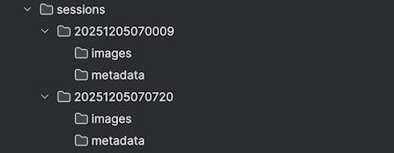

# Yolo-Trap

Yolo-Trap is an expermental AI insect-trap which uses Raspberry-Pi hardware and a  custom-trained Yolo11n model to detect and capture images of insects .

The trap is based on the concepts and training data from this project:

[Sittinger M, Uhler J, Pink M, Herz A (2024) Insect detect: An open-source DIY camera trap for automated insect monitoring. PLOS ONE 19(4): e0295474](https://doi.org/10.1371/journal.pone.0295474)

This project uses a relatively expensive [Luxonis OAK-1 AI camera,](https://shop.luxonis.com/products/oak-1?variant=42664380334303) whereas the Yolo-Trap project uses a stardard [Raspberry Pi camera](https://www.raspberrypi.com/documentation/accessories/camera.html), and runs the detection model on the Raspberry Pi itself, the aim being to provide a more cost effective solution.

The primary function of the Yolo-Trap is to provide a set of hi-resolution images of insects detected by the trap. It does not attempt to classify the insects. Classification will be performed by an offline workflow which will be described later.

## Processing Flow

The Yolo-Trap processing flow is implemented in Python, and is based around these Python packages

- **[Picamera2](https://datasheets.raspberrypi.com/camera/picamera2-manual.pdf)** - management of the camera and creation of video streams.
- **[Ultralytics](https://docs.ultralytics.com/usage/python/)** - management of the Yolo model
- **[OpenCV2](https://pypi.org/project/opencv-python/)** - stream and image processing

### Camera and Video Streams

The starting point of the flow is the video camera. In the prototype this is a Pi Camera 3  - a 4K camera with autofocus.

The camera is controlled by the picamera2 Python library and is confugured to provide 2 video streams:

- main - 2028 x 1520 24bit colour
- lores - 320 x 320 24bit colour

The camera frame rate is 30fps, however the actual frame rate of the flow will depend on the speed of the downstream processing, and will be a lot less than this.

### Yolo11n Detection Model and Tensors

Frames from the 'lowres' stream provide the input tensors to the [Yolo11n detection model](https://docs.ultralytics.com/tasks/detect/). The model uses PyTorch format (.pt), and is run in the Ultralytics Python framework.  The model is trained to detect "insects".  It does not provide any other classification, so there is only one class - 'insect'

The model is a 'detection' model, and in this application Yolo11 'tracking'  is also used. This means that the model tracks previously detected insects as they move within successive frames. Each unique tracked insect is assigned a unique track-id allowing multiple detections of the same insect to be  identified. 

The model outputs a tensor containing zero or more detection objects, each comprising:

- The bounding rectangle of the insect within the 320 x 320 frame.
- The 'score' for the match (from 0 to 1, with  1 a perfect match)
- The detection class - always 'insect'
- The track-id - which persists between frames.

### Object Extraction

Detection objects with a low score (configurable) are discarded, otherwise:

The detection rectangle is scaled to create the corresponding rectangle in the "main" 2028 x 1520 frame which is then cropped from the frame to give a high resolution image of the insect.

### File and Metadata Management

#### Sessions

The Yolo-Trap organises captured data into sessions. A session contains the set of data captured in a singlecontinuous period. 

A session is defined by a session_id which is the timestamp when the capture started. It has the format  YYYYMMDDHHMMSS e.g`20251205045854`

#### Tracks

The Yolo-Trap uses [Yolo tracking](https://docs.ultralytics.com/modes/track/) to identify multiple detections of the same insect.  On first detection Yolo assigns a unique track-id to the insect. Successive detections of the same insect will be assigned the same track-id, therefore the Yolo-Trap considers track-ids to represent individual insects.

> *Note - if an insect leaves the trap and returns some time later Yolo will not be able to associate it with its previous visit, and it will be considered to be a different insect.*

#### Image Selection

Typically many images will be captured for a single insect. The Yolo-Trap will chose and save the image with the highest score and this will used for classification.

> *Open- it would be possible to save all the images allowing multiple classification attempts for the same insect. This might improve the classification accuracy, at the expense of speed (each image is relatively small - approk 5k).*

#### Identity

As mentioned above when the Yolo-Trap runs it creates a session with a unique session-id. All recorded data exists within the context of the session. Whenever a session is started the track-id restarts from 1. The track-id is used to identify an insect and the Yolo-Trap pads it to 6-digits when creating files e,g:

- *`000001.jpg`* is the image of insect/track-id 1.
- **`000001.csv`** is the metadata of insect/track-id 1.

#### Data Organisation

Session data is organised according to the following directory structure:

Each session has its own directory with two subdirectories:

- images - containing the cropped insect images for offline inference.
- metadata - one file per image containg the image's metadata (see below)

### Metadata

Tbd
